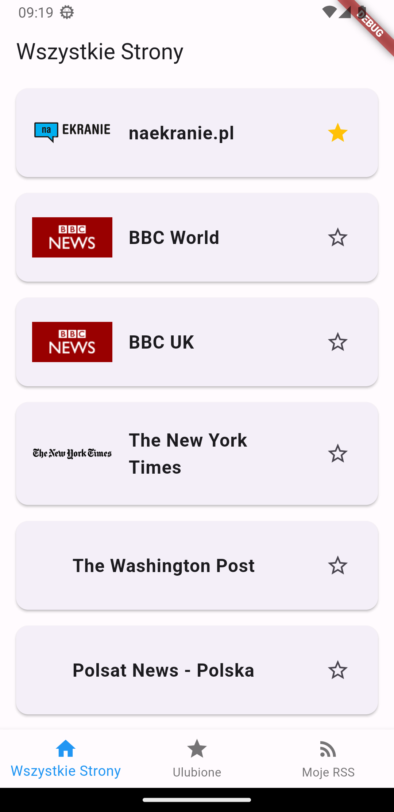
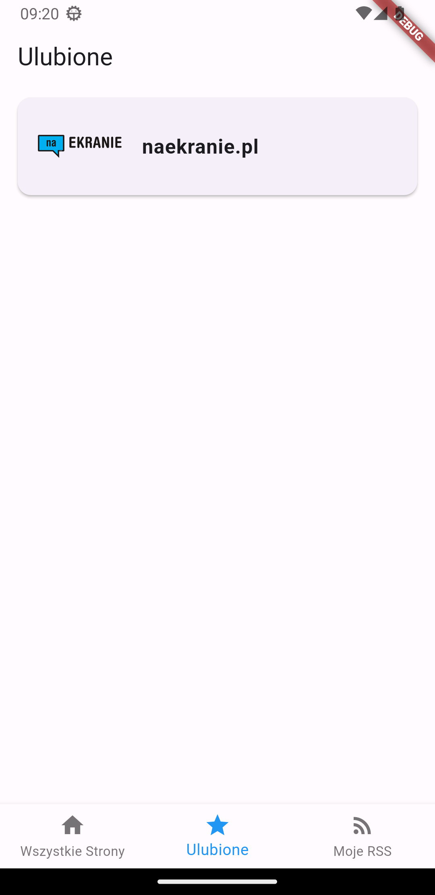
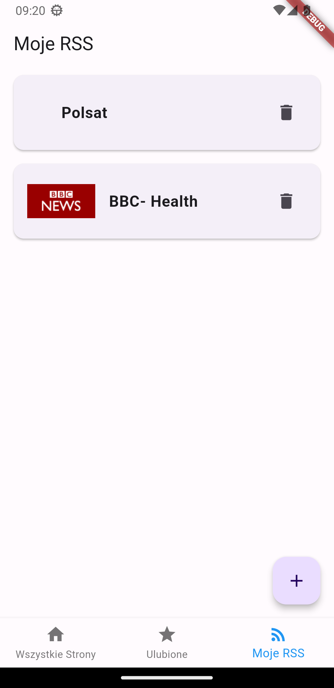
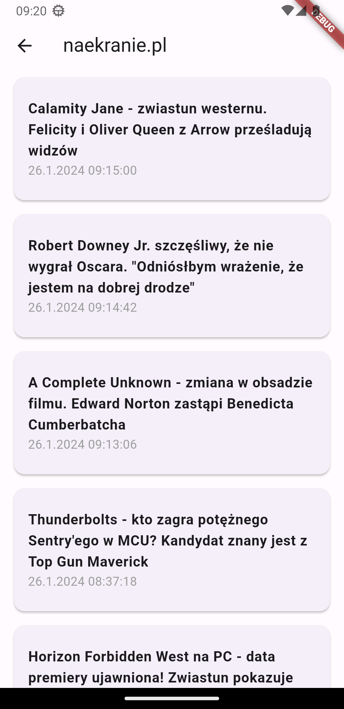

# RSS Reader App

## Description

The RSS Reader app is a simple RSS feed reader that allows users to follow the latest articles from various sources. The app offers three main functions: browsing all available RSS channels, managing favorite channels, and adding and managing custom RSS channels.

## Features

1. **Browse All Pages:**
   - Users can view a list of available RSS channels.
   - Each channel is represented by a name, logo (if available), and the option to add it to favorites.

2. **Favorites:**
   - Users can view a list of favorite RSS channels.
   - Each favorite channel is represented by a name, logo (if available), and the option to remove it from favorites.
   - Upon selecting a favorite channel, users can see a list of the latest articles.

3. **My RSS:**
   - Users can add their custom RSS channel by providing the channel name and source link.
   - Before adding, the link is validated to ensure it is a valid RSS channel.
   - Added channels are displayed on the list, with the option to remove them.

## Technologies

The app is built using the Dart programming language and the Flutter framework. It also utilizes the SQLite database to store favorite channels and user-added RSS channels.

## Screenshots

### Home Screen

The Home Screen displays a list of available RSS feeds. Users can tap on a feed to view its articles.

### Favorites Screen

The Favorites Screen shows a list of user-selected favorite RSS feeds. Users can quickly access their preferred sources.

### My RSS Feeds Screen

In the My RSS Feeds Screen, users can add custom RSS feeds by providing a name and link. Added feeds appear with a delete icon for easy removal.

### Articles Screen

The Articles Screen displays a list of articles from a selected RSS feed. Users can mark articles as favorites.

### Selected Article Screen

The view of an article opened in the application's built-in browser.

## Creator's Profile

Visit the [creator's profile](https://github.com/krzysztofb200) for more projects and updates.